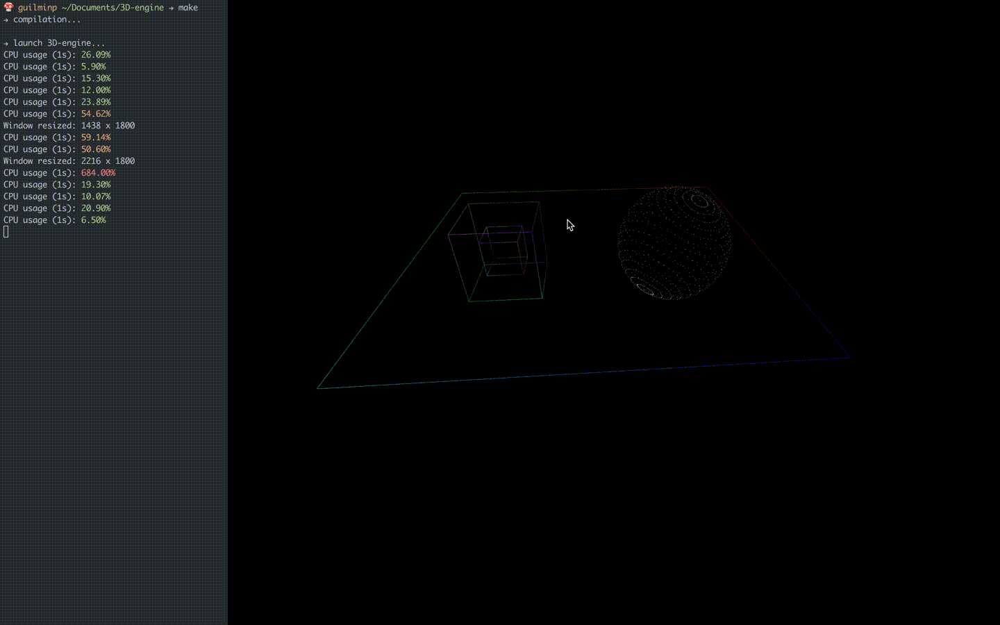
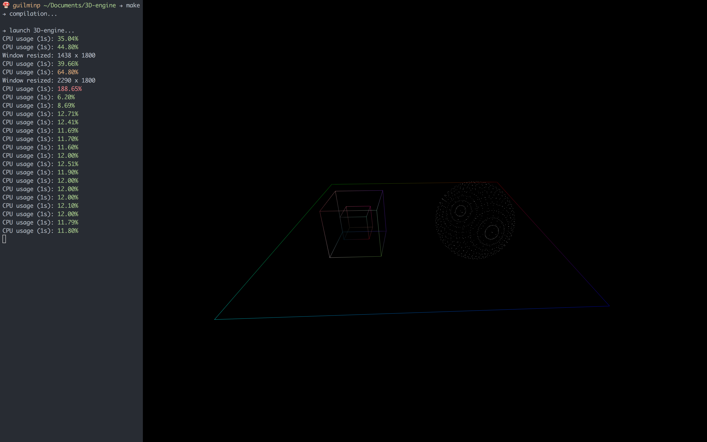

[](https://travis-ci.org/PierreGuilmin/test_3D-engine)

# 3D-engine

This project is a 3d-rendering engine made from scratch in C++ **without using any 3d-rendering libraries** (like OpenGL or so).

:construction: Work in progress... :construction:

***




## Work with this repository

:warning: Because I just created this repository the project is still not well commented, come back soon!

### Clone the repository

To clone this repository on your local computer please run:
```bash
$ git clone https://github.com/PierreGuilmin/3D-engine.git
```

### Install SFML
This project was written in **C++** (C++11). It uses the open-source library [SFML](https://www.sfml-dev.org/index.php) (SFML 2.5.0) which is a cross-platform library written in C++ to open windows, draw 2d lines/images, handle the keyboard and the mouse... The easiest way to install it on macOS is by using the (famous) 🍺[Homebrew](https://brew.sh) package manager:
```bash
$ brew install sfml
```
Otherwise for Windows user the library can be compiled from source on the SFML website under the [Download](https://www.sfml-dev.org/download/sfml/2.5.0/index.php) section.

### Compile the project
The default compiler used in the makefile is `clang++`. Running the following command in the project folder will compile the sources and create an executable called **3D-engine**:
```bash
$ make
```

To clean the project `.o` and `.d` located in `/obj` and remove the executable you can run in the project folder:
```bash
$ make clean
```

If you don't have `clang++` you can compile the project with any another compiler (`g++` for example), by modifying the two first lines of the `makefile` to match your compiler favorite settings:
```bash
# current makefile first lines
CXX      = clang++ # compiler name
CXXFLAGS = -std=c++11 -Weverything -Wno-c++98-compat -Wno-padded -Wno-conversion -Wno-global-constructors -Wno-exit-time-destructors # compiler flags

# change for something like
CXX      = g++
CXXFLAGS = -Wall -Wno-c++11-extensions
```

### Emoji commit code table

Please use the following table to commit code:

| emoji        | meaning                      | code           |
| :----------: | :--------------------------- | :------------- |
| :sos:        | critical bug                 | `:sos:`        |
| :warning:    | bug                          | `:warning:`    |
| :eyes:       | to check                     | `:eyes:`       |
| :flashlight: | simplification/clarification | `:flashlight:` |
| :clipboard:  | comment                      | `:clipboard:`  |
| :sparkles:   | typos & style                | `:sparkles:`   |
| :tada:       | new feature                  | `:tada:`       |
| :cloud:      | minor modification           | `:cloud:`      |

For example if you want to commit a new rocket feature — `🎉 new feature, flying rocket!` — please do:
```diff
# bad syntax
- $ git commit -m 'new feature, flying rocket!'

# good syntax
+ $ git commit -m ':tada: new feature, flying rocket!'
```

## Another 3d engine?!

This is a project I did on my own during my free time because I was curious about 3d rendering and wanted to practice C++. The goal was to render 3d objects on my screen without using any 3d libraries like OpenGL, doing every projections from the 3d space to the 2d screen on my own, as well as handling the camera rotation and objects movements. The only library used is the 2d library [SFML](https://www.sfml-dev.org/index.php).

See under a view of the basic scene proposed in `main.cpp` (the application is on the right, the left pannel is a terminal instance):



## The commands

The commands to move in the 3d space are really intuitive and shouln't cause any trouble:
* Move your mouse to see around
* Use `Z` (front), `Q` (left), `S` (back), `D` (right) to move (front and back are going in the direction where your mouse points)
* Use `A` (up), `E` (down) to move along the third axis


## The code architecture
**`/src/utils`**  
Implement basic helpers class and functions:
* `mouse.hpp` and `mouse.cpp`: facilitate the access to the mouse last movement
* `tools.hpp` and `tools.cpp`: various small tool functions
* `looptimer.hpp` and `looptimer.cpp`: implement an automatic repeating timer

**`/src/geometry`**  
At the heart of the engine:
* `vector3d.hpp` and `vector3d.cpp`: implement the `Vector3d` class that represents a vector in a 3d space
* `segment3d.hpp` and `segment3d.cpp`: implement the `Segment3d` class
* `plane3d.hpp` and `plane3d.cpp`: implement the `Plane3d` class
* `camera3d.hpp` and `camera3d.cpp`: implement the `Camera3d` class
* `solid3d.hpp` and `solid3d.cpp`: base class to create a solid


The `main.cpp` setup the window, create the objects and handle the event and the display in the main loop of the program.  
Notice how easy it is to create and render:
* a cube of size 50 centered in (0, 0, 0):
    ```C++
    // → at the beginning of the main
    Cube3d cube(Vector3d(0, 0, 0), 50);

    // → in the main loop
    // render the cube on the given window with the given camera view
    cube.render_solid(window, camera);
    ```
* the white rotating sphere on the image:
    ```C++
    // → at the beginning of the main
    // create the sphere specifying:
    //   - the sphere center: (60, 0, 0)
    //   - the sphere size: 40
    //   - the number of circle: 20
    //   - the number of points per circle: 50
    // so this sphere is made of 20 x 50 = 1,000 points
    Sphere3d rotating_sphere(Vector3d(60, 0, 0), 40, 20, 50);

    // → in the main loop
    // rotate sphere around the given axis by 3 degrees every loop
    rotating_sphere.rotate(Vector3d(1, 1, 0), 3);
    // render the sphere on the given window with the given camera view
    rotating_sphere.render_solid(window, camera);
    ```
